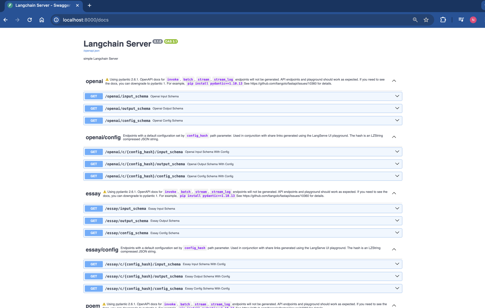
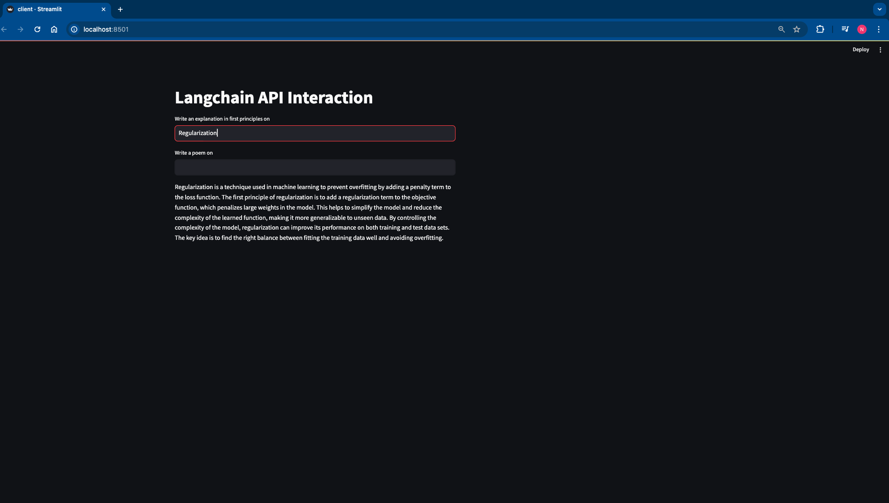
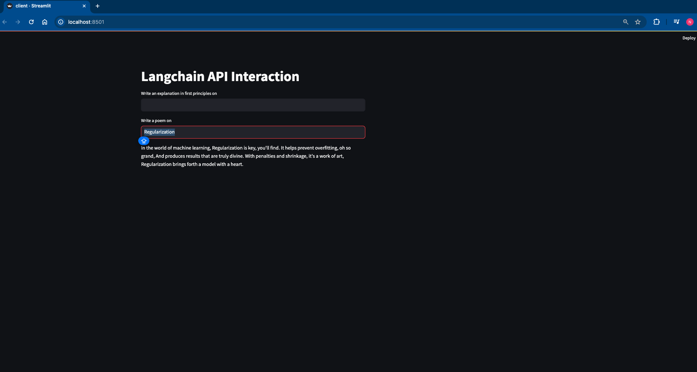

# Langchain API Interaction

This project demonstrates the interaction with the Langchain API using OpenAI and open-source models. It allows you to explain concepts using first principles with the OpenAI model and generate poetic content using open-source models.

## Prerequisites

- Python 3.x
- Required dependencies in requirements file and required API keys.

## Installation

1. Clone the repository:
    
    ```bash
    git clone https://github.com//langchain-api-interaction.git
    ```
2. Change to the project directory:

    ```bash
    cd api_based_apps
    ```
## Usage

1. Run the following command to deploy the app:

    ```bash
    python app.py
    ```

2. Once the app is deployed, you can access it by navigating to the following URL:

    

3. After accessing the app, you can write client code using any interface like Streamlit. Run file named `client.py` and run it using the following command:

    ```bash
    streamlit run client.py
    ```
4. The app will provide two options:

- First box: After clicking enter triggers the OpenAI API to explain concepts using first principles.

  

- Second box: After clicking enter triggers the open-source models using Ollam to generate poetic content.

  

## Configuration

- OpenAI API Key: Make sure to set up your OpenAI API key in the configuration file or environment variables.
- Open Source Models: Specify the open-source models you want to use for generating poetic content.

## Contributing

Contributions are welcome! If you find any issues or have suggestions for improvements, please open an issue or submit a pull request.

## License

This project is licensed under the [MIT License](LICENSE).

## Acknowledgements

- [Langchain]for providing the API functionality.
- [OpenAI]for the powerful language models.
- [Ollama] for the open-source models.
