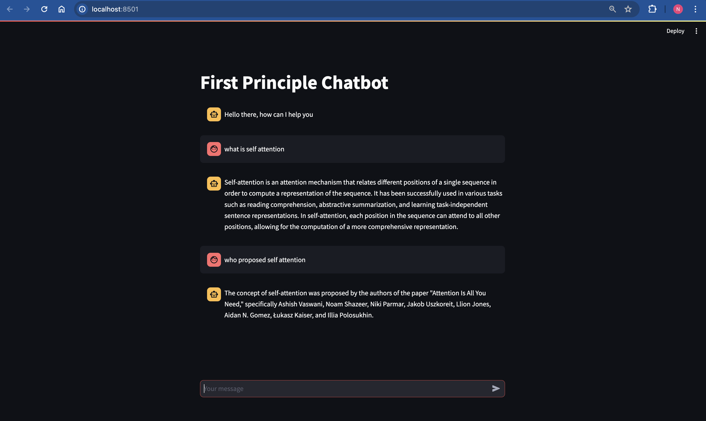

# RAG Based Chatbot

This is a RAG chatbot that provides responses based on first principles mainly based on Transformer Architecture paper, Although It is well known to all the gpt's the point is it can be replaced with any PDF's and just change to use only the context strictly in prompt.  

The Primary aim of this too is to assist users with their questions. The chatbot is designed to maintain clarity and brevity in its responses. It utilizes a combination of language models, document retrieval, and vector embeddings to generate relevant and informative answers.

## Setup

1. Install the required dependencies by running:

```bash
    pip install requirements.txt
```


2. Make sure to have an OpenAI API key and store it in a `.env` file:

OPENAI_API_KEY=your_api_key_here


3. Run the Streamlit app by executing:

```bash
    streamlit run app.py
```

make sure to have the pdf's in the same directory and change the path in the code to the pdf's you want to use. PDF is just for the example you can use any text file or any other format or even from web pages and export the text from it. It is pretty simple to do that. refer https://python.langchain.com/docs/modules/data_connection/document_loaders/ for more information.

## Usage

1. Once the app is running, you'll be greeted with a chat interface.

2. Start typing your questions or queries into the input box.

3. The chatbot will respond with answers based on first principles approach.

4. If you're satisfied with the response, consider tipping the chatbot with $1000. just kidding.

## Components

- **ChatPromptTemplate**: Defines the prompt structure for the chatbot, specifying the context and user input format.

- **Document Loader**: Loads PDF documents for retrieval and analysis.

- **Text Splitter**: Splits the loaded documents into smaller chunks for processing.

- **Vector Embeddings**: Utilizes Chroma or FAISS embeddings to represent document chunks.

- **Language Models (LLMs)**: Chooses between Ollama or ChatOpenAI for generating responses.

- **Document Chain**: Creates a chain of processes for document retrieval and analysis.

- **Retrieval Chain**: Combines document retrieval with language model responses.

## Dependencies

- `streamlit`: For creating the interactive chat interface.
- `langchain_core`: Core components for language processing and document analysis.
- `langchain_community`: Community-contributed modules for additional functionality.
- `langchain_openai`: Integration with OpenAI's language models.

---

sample output:


## Conclusion
Feel free to customize and enhance the chatbot according to your requirements. If you have any questions or feedback, please don't hesitate to reach out. 
